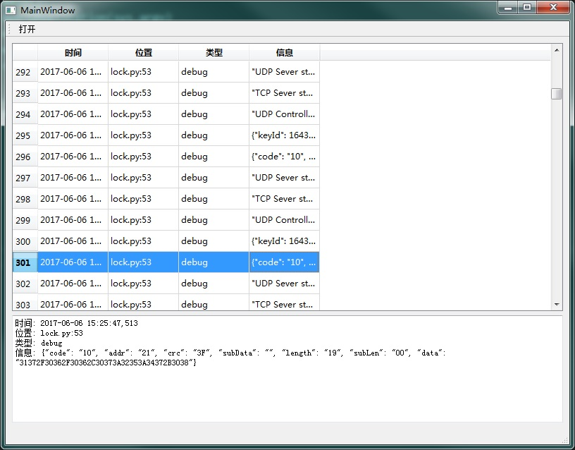

# LogViewer 

## 设计初衷
python 的日志输出保存在log文件中，使用文本阅读器查看的话不是很直观，特别是日志信息又长又多的时候。
为此需要个比较人性化方便人只管查看的查看器（日志查看器）。

## 设计灵感
源自：Windows自带的事件查看器
只实现了最基本的功能。

## 截图

## 功能
- 打开.log日志文件
- 表格方式展现日志内容
- 选中查看详细信息

## 感言
顺带学习了QTableView和QTextBrowser的使用。